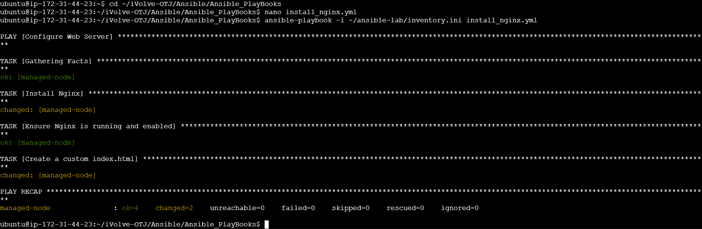
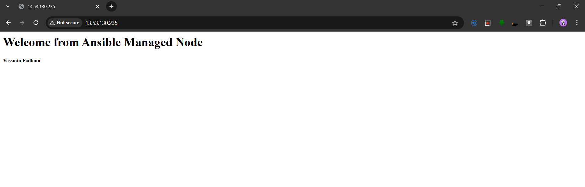

#  Ansible Playbook : Web Server Configuration

## Objective

Use Ansible to configure a web server (Nginx), deploy a customized HTML page, and verify setup.

---

## Environment

- **Control Node**: EC2 Instance 1 (Ubuntu)
- **Managed Node**: EC2 Instance 2 (Ubuntu)
- **Connection**: SSH with key-based authentication (already set up)

---

## Steps and Commands

```bash
# 1. Create playbook file
nano install_nginx.yml

# 2. [`install_nginx.yml`](./install_nginx.yml) content:
---
- name: Configure Web Server
  hosts: managed
  become: true
  tasks:

    - name: Install Nginx
      apt:
        name: nginx
        state: present
        update_cache: yes

    - name: Start and enable Nginx
      systemd:
        name: nginx
        enabled: yes
        state: started

    - name: Deploy custom index.html
      copy:
        dest: /var/www/html/index.nginx-debian.html
        content: |
          <!DOCTYPE html>
          <html lang="en">
          <head>
              <meta charset="UTF-8">
              <title>Welcome</title>
              <style>
                  body {
                      font-family: Arial, sans-serif;
                      background-color: #f4f4f4;
                      text-align: center;
                      padding-top: 100px;
                  }
                  h1 {
                      color: #333;
                  }
                  p {
                      color: #777;
                  }
              </style>
          </head>
          <body>
              <h1>Welcome to the Web Server</h1>
              <p>Powered by Ansible | Managed by Yassmin Fadloun</p>
          </body>
          </html>

# 3. Run the playbook
ansible-playbook -i ~/ansible-lab/inventory.ini install_nginx.yml

# Output:
```markdown

```
# 4. Verify from browser:
http://<public-ip-of-managed-node>
```

---

## Files Included

- [`install_nginx.yml`](./install_nginx.yml): Playbook to configure Nginx and deploy a web page.

---

## Output Screenshot

```markdown

```
