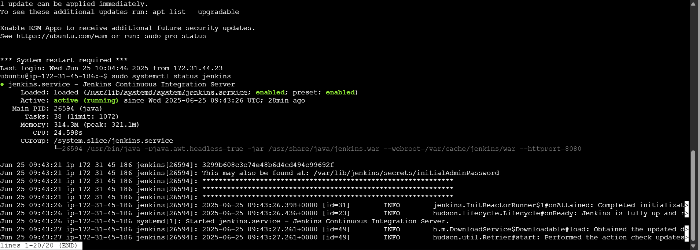

# Ansible Roles for Application Deployment

## Objective
Create and run Ansible roles for:
- Docker
- Kubernetes CLI (`kubectl`)
- Jenkins

## Directory Structure
```
Ansible_Roles/
├── docker/
│   └── tasks/
│       └── main.yml
├── jenkins/
│   └── tasks/
│       └── main.yml
├── kubectl/
│   └── tasks/
│       └── main.yml
├── install_apps.yml
├── install_apps.txt
└── README.md
```

## Steps

1. Create the roles:
   ```bash
   ansible-galaxy init docker
   ansible-galaxy init kubectl
   ansible-galaxy init jenkins
   ```

2. Add tasks in `tasks/main.yml` for each role (Docker, Jenkins, kubectl).

3. Create a playbook `install_apps.yml`:
   ```yaml
   ---
   - name: Run roles to install apps
     hosts: managed
     become: true
     roles:
       - docker
       - kubectl
       - jenkins
   ```

4. Run the playbook:
   ```bash
   ansible-playbook -i ~/ansible-lab/inventory.ini ~/iVolve-OTJ/Ansible/Ansible_Roles/install_apps.yml
   ```

5. Verify on the managed node:
   ```bash
   java -version
   sudo systemctl status jenkins
   docker --version
   kubectl version --client
   ```

## Result Screenshot



---

## Related Files
- [`install_apps.yml`](install_apps.txt)
